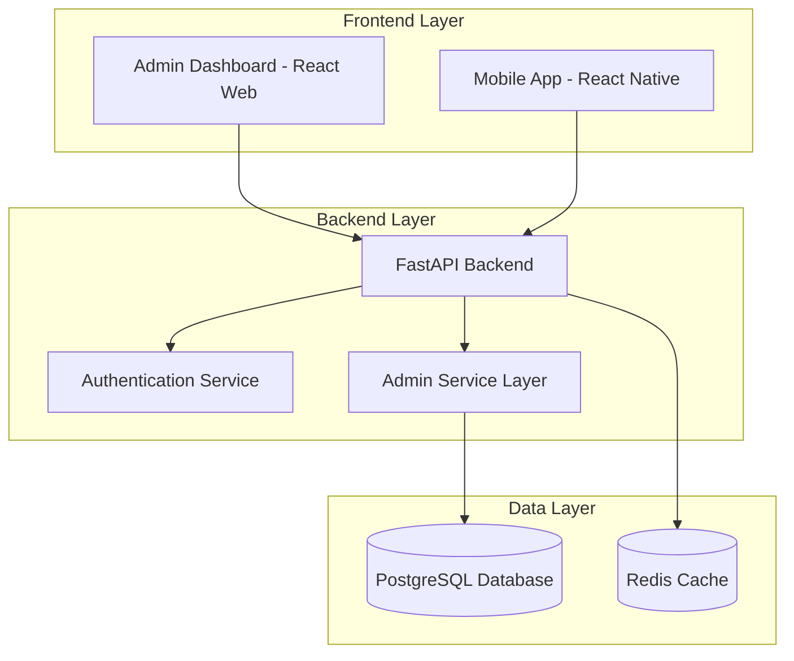
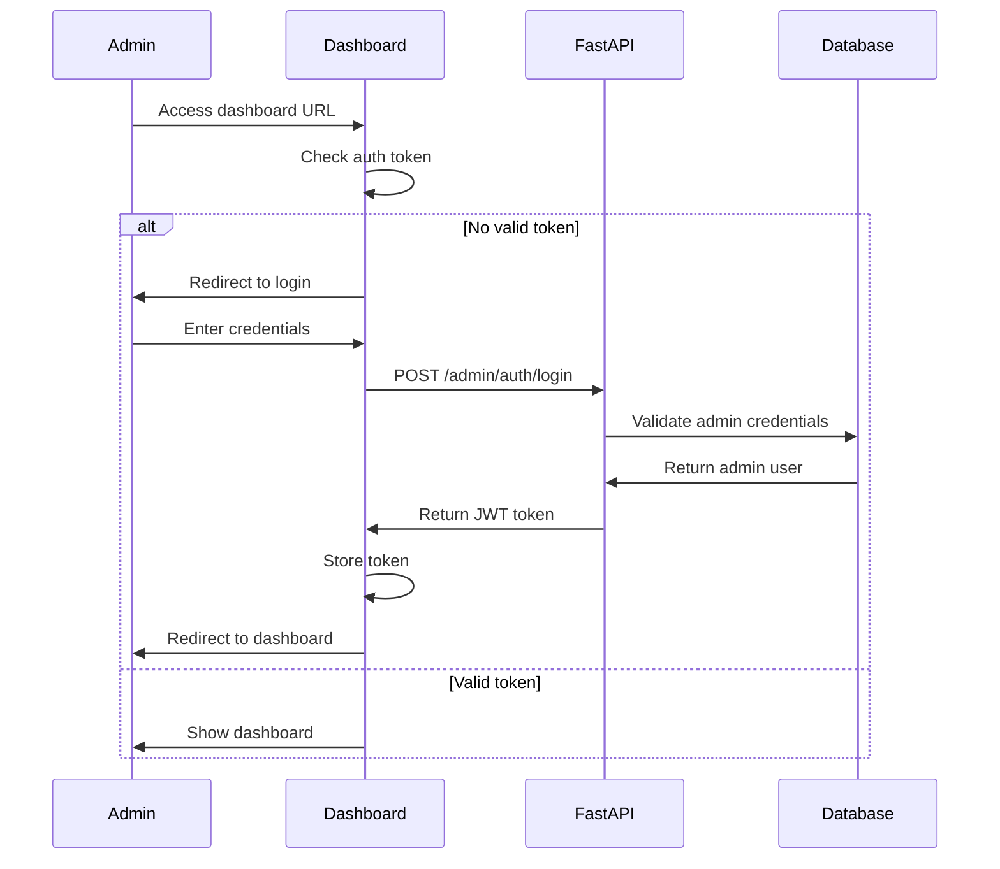

# Admin Dashboard Design Document

## Overview

The admin dashboard will be a separate React web application that provides comprehensive administrative capabilities for the sports platform. It will maintain the same clean, classy, and minimal design philosophy as the mobile app while being optimized for desktop data management and analytics. The dashboard will share the existing FastAPI backend and PostgreSQL database, extending the current API with admin-specific endpoints.

## Architecture

### High-Level Architecture



### Technology Stack

**Frontend (Admin Dashboard)**
- **React 18** with TypeScript for type safety
- **Vite** for fast development and building
- **React Router v6** for navigation
- **TanStack Query** for server state management
- **Recharts** for data visualization and charts
- **Tailwind CSS** for styling with custom design system
- **Headless UI** for accessible components
- **React Hook Form** with Zod validation

**Backend Extensions**
- Extend existing FastAPI backend with admin endpoints
- Add admin authentication middleware
- Implement analytics and reporting services
- Add data export capabilities

## Components and Interfaces

### 1. Authentication System

#### Admin Authentication Flow


#### Admin User Model Extension
```typescript
interface AdminUser {
  id: number;
  email: string;
  full_name: string;
  role: 'super_admin' | 'admin' | 'moderator';
  permissions: AdminPermission[];
  is_active: boolean;
  last_login: Date;
  created_at: Date;
}

interface AdminPermission {
  resource: 'users' | 'videos' | 'analytics' | 'system';
  actions: ('read' | 'write' | 'delete' | 'export')[];
}
```

### 2. Layout System

#### Main Layout Structure
```typescript
interface DashboardLayout {
  sidebar: {
    width: '280px';
    background: 'white';
    shadow: 'subtle';
    navigation: NavigationItem[];
  };
  header: {
    height: '64px';
    background: 'white';
    border: 'bottom-light';
    content: ['breadcrumbs', 'user-menu', 'notifications'];
  };
  main: {
    padding: '24px';
    background: 'gray-50';
    overflow: 'auto';
  };
}
```

#### Navigation Structure
```typescript
const navigationItems: NavigationItem[] = [
  {
    label: 'Overview',
    icon: 'dashboard',
    path: '/',
    children: []
  },
  {
    label: 'Analytics',
    icon: 'chart-bar',
    path: '/analytics',
    children: [
      { label: 'User Metrics', path: '/analytics/users' },
      { label: 'Sport Analytics', path: '/analytics/sports' },
      { label: 'Engagement', path: '/analytics/engagement' }
    ]
  },
  {
    label: 'User Management',
    icon: 'users',
    path: '/users',
    children: []
  },
  {
    label: 'Content',
    icon: 'video',
    path: '/content',
    children: [
      { label: 'Videos', path: '/content/videos' },
      { label: 'Moderation', path: '/content/moderation' }
    ]
  },
  {
    label: 'System',
    icon: 'cog',
    path: '/system',
    children: [
      { label: 'Performance', path: '/system/performance' },
      { label: 'Logs', path: '/system/logs' }
    ]
  }
];
```

### 3. Data Visualization Components

#### Chart Component System
```typescript
interface ChartProps {
  data: any[];
  type: 'line' | 'bar' | 'pie' | 'area' | 'donut';
  title: string;
  subtitle?: string;
  height?: number;
  colors?: string[];
  loading?: boolean;
  error?: string;
}

// Usage Examples
<LineChart
  data={userRegistrationData}
  title="User Registrations"
  subtitle="Last 30 days"
  height={300}
  colors={['#3182CE', '#22C55E']}
/>

<PieChart
  data={sportPopularityData}
  title="Sport Popularity"
  height={400}
  colors={theme.colors.chart}
/>
```

#### KPI Card Component
```typescript
interface KPICardProps {
  title: string;
  value: string | number;
  change?: {
    value: number;
    period: string;
    trend: 'up' | 'down' | 'neutral';
  };
  icon?: React.ReactNode;
  loading?: boolean;
}

// Usage
<KPICard
  title="Total Users"
  value={1247}
  change={{ value: 12.5, period: 'vs last month', trend: 'up' }}
  icon={<UsersIcon />}
/>
```

### 4. Data Management Components

#### Advanced Data Table
```typescript
interface DataTableProps<T> {
  data: T[];
  columns: ColumnDef<T>[];
  loading?: boolean;
  pagination?: {
    page: number;
    pageSize: number;
    total: number;
    onPageChange: (page: number) => void;
  };
  sorting?: {
    field: keyof T;
    direction: 'asc' | 'desc';
    onSort: (field: keyof T, direction: 'asc' | 'desc') => void;
  };
  filtering?: {
    filters: Filter[];
    onFilterChange: (filters: Filter[]) => void;
  };
  selection?: {
    selectedRows: T[];
    onSelectionChange: (rows: T[]) => void;
  };
  actions?: TableAction<T>[];
}
```

#### Filter System
```typescript
interface FilterConfig {
  sports: {
    type: 'multiselect';
    options: SportOption[];
    placeholder: 'Select sports...';
  };
  dateRange: {
    type: 'daterange';
    defaultRange: 'last30days';
  };
  userStatus: {
    type: 'select';
    options: ['active', 'inactive', 'suspended'];
  };
  experienceLevel: {
    type: 'multiselect';
    options: ['beginner', 'intermediate', 'advanced', 'professional'];
  };
}
```

## Data Models

### 1. Analytics Data Models

#### User Analytics
```typescript
interface UserAnalytics {
  totalUsers: number;
  activeUsers: number;
  newUsersToday: number;
  newUsersThisWeek: number;
  newUsersThisMonth: number;
  userGrowthRate: number;
  registrationTrend: TimeSeriesData[];
  usersByLocation: LocationData[];
  usersBySport: SportData[];
  usersByExperience: ExperienceData[];
}

interface TimeSeriesData {
  date: string;
  value: number;
  label?: string;
}
```

#### Sport Analytics
```typescript
interface SportAnalytics {
  sportPopularity: SportPopularityData[];
  sportGrowthTrends: SportTrendData[];
  sportEngagement: SportEngagementData[];
  topSports: SportRankingData[];
}

interface SportPopularityData {
  sport: string;
  userCount: number;
  percentage: number;
  growth: number;
}
```

#### System Analytics
```typescript
interface SystemAnalytics {
  apiMetrics: {
    totalRequests: number;
    averageResponseTime: number;
    errorRate: number;
    uptime: number;
  };
  databaseMetrics: {
    connectionCount: number;
    queryPerformance: number;
    storageUsed: number;
    storageTotal: number;
  };
  performanceAlerts: Alert[];
}
```

### 2. Extended User Models

#### Admin User View
```typescript
interface AdminUserView extends User {
  activitySummary: {
    lastLogin: Date;
    sessionCount: number;
    totalVideoViews: number;
    profileCompleteness: number;
  };
  moderationFlags: {
    reportCount: number;
    warningCount: number;
    suspensionHistory: SuspensionRecord[];
  };
  engagementMetrics: {
    averageSessionDuration: number;
    featuresUsed: string[];
    lastActivity: Date;
  };
}
```

### 3. Video Content Models

```typescript
interface VideoContent {
  id: string;
  title: string;
  description: string;
  sport: string;
  category: string;
  uploadedBy: string;
  uploadDate: Date;
  duration: number;
  fileSize: number;
  viewCount: number;
  likeCount: number;
  status: 'active' | 'pending' | 'flagged' | 'removed';
  moderationFlags: ModerationFlag[];
  thumbnailUrl: string;
  videoUrl: string;
  tags: string[];
}

interface ModerationFlag {
  id: string;
  type: 'inappropriate' | 'copyright' | 'spam' | 'other';
  reason: string;
  reportedBy: string;
  reportedAt: Date;
  status: 'pending' | 'resolved' | 'dismissed';
  reviewedBy?: string;
  reviewedAt?: Date;
}
```

## Error Handling

### Error Boundary System
```typescript
interface ErrorBoundaryState {
  hasError: boolean;
  error?: Error;
  errorInfo?: ErrorInfo;
}

// Global error handling for API calls
const useErrorHandler = () => {
  const showNotification = useNotification();
  
  return useCallback((error: ApiError) => {
    switch (error.status) {
      case 401:
        // Redirect to login
        window.location.href = '/login';
        break;
      case 403:
        showNotification('Access denied', 'error');
        break;
      case 500:
        showNotification('Server error. Please try again.', 'error');
        break;
      default:
        showNotification(error.message || 'An error occurred', 'error');
    }
  }, [showNotification]);
};
```

### Loading States
```typescript
interface LoadingState {
  isLoading: boolean;
  loadingMessage?: string;
  progress?: number;
}

// Skeleton components for different content types
const ChartSkeleton = () => (
  <div className="animate-pulse">
    <div className="h-4 bg-gray-200 rounded w-1/4 mb-4"></div>
    <div className="h-64 bg-gray-200 rounded"></div>
  </div>
);

const TableSkeleton = () => (
  <div className="animate-pulse space-y-4">
    {[...Array(5)].map((_, i) => (
      <div key={i} className="flex space-x-4">
        <div className="h-4 bg-gray-200 rounded flex-1"></div>
        <div className="h-4 bg-gray-200 rounded flex-1"></div>
        <div className="h-4 bg-gray-200 rounded flex-1"></div>
      </div>
    ))}
  </div>
);
```

## Testing Strategy

### 1. Unit Testing
- **Component Testing**: Test individual React components with React Testing Library
- **Hook Testing**: Test custom hooks with @testing-library/react-hooks
- **Utility Testing**: Test utility functions and data transformations
- **API Integration**: Mock API calls and test error handling

### 2. Integration Testing
- **User Flows**: Test complete user journeys through the dashboard
- **API Integration**: Test real API calls with test database
- **Authentication**: Test login/logout flows and permission handling
- **Data Visualization**: Test chart rendering with various data sets

### 3. E2E Testing
- **Playwright**: Test critical admin workflows
- **Visual Regression**: Ensure UI consistency across updates
- **Performance**: Test dashboard performance with large datasets
- **Cross-browser**: Ensure compatibility across modern browsers

### 4. Performance Testing
- **Bundle Analysis**: Monitor and optimize bundle size
- **Rendering Performance**: Test with large datasets
- **Memory Usage**: Monitor for memory leaks
- **API Response Times**: Test with realistic data volumes

## Design System Integration

### Color Palette (Minimal & Classy)
```typescript
const adminTheme = {
  colors: {
    primary: {
      50: '#EBF8FF',
      500: '#3182CE',
      600: '#2C5282',
      900: '#1A365D'
    },
    neutral: {
      50: '#F9FAFB',
      100: '#F3F4F6',
      200: '#E5E7EB',
      500: '#6B7280',
      700: '#374151',
      900: '#111827'
    },
    success: '#22C55E',
    warning: '#F59E0B',
    error: '#EF4444',
    chart: ['#3182CE', '#22C55E', '#F59E0B', '#EF4444', '#8B5CF6', '#06B6D4']
  },
  spacing: {
    xs: '4px',
    sm: '8px',
    md: '16px',
    lg: '24px',
    xl: '32px',
    '2xl': '48px'
  },
  borderRadius: {
    sm: '4px',
    md: '8px',
    lg: '12px',
    xl: '16px'
  },
  shadows: {
    sm: '0 1px 2px 0 rgb(0 0 0 / 0.05)',
    md: '0 4px 6px -1px rgb(0 0 0 / 0.1)',
    lg: '0 10px 15px -3px rgb(0 0 0 / 0.1)'
  }
};
```

### Typography System
```typescript
const typography = {
  fontFamily: {
    sans: ['Inter', 'system-ui', 'sans-serif'],
    mono: ['JetBrains Mono', 'monospace']
  },
  fontSize: {
    xs: '12px',
    sm: '14px',
    base: '16px',
    lg: '18px',
    xl: '20px',
    '2xl': '24px',
    '3xl': '30px',
    '4xl': '36px'
  },
  fontWeight: {
    normal: 400,
    medium: 500,
    semibold: 600,
    bold: 700
  }
};
```

### Component Styling Approach
- **Tailwind CSS** for utility-first styling
- **CSS Modules** for component-specific styles when needed
- **Consistent spacing** using design system tokens
- **Subtle animations** for enhanced user experience
- **Clean borders and shadows** for depth without clutter

## Security Considerations

### Authentication & Authorization
- JWT-based authentication with refresh tokens
- Role-based access control (RBAC)
- Route-level permission checking
- API endpoint protection
- Session timeout handling

### Data Protection
- Input validation and sanitization
- XSS protection
- CSRF protection
- Secure API communication (HTTPS)
- Sensitive data masking in logs

### Audit Logging
- Admin action logging
- User data access tracking
- System change monitoring
- Export activity logging
- Failed authentication attempts

This design provides a comprehensive foundation for building a clean, minimal, and highly functional admin dashboard that maintains consistency with your existing mobile app while providing powerful administrative capabilities.